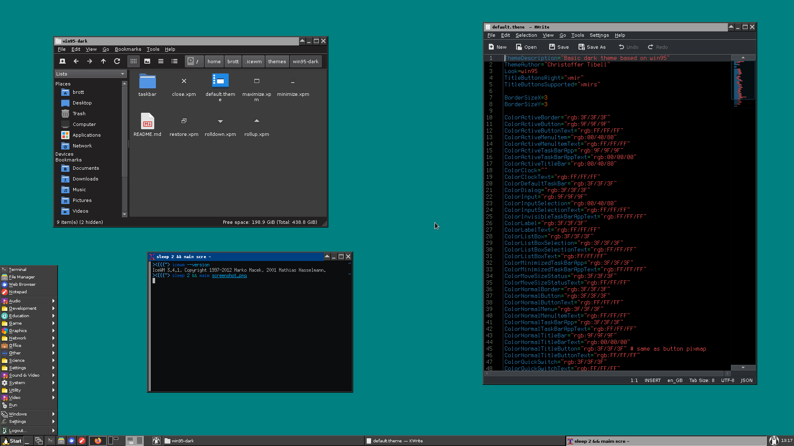

Win95 Dark for IceWM
--------------------

Dark variant of the Win95 theme for IceWM. 
This theme is, in general, just to be a good looking, basic dark theme.

# Screenshot



# Installation

Clone the repo into your themes folder.
```bash
mkdir -p $HOME/.icewm/themes
git clone https://github.com/Brottweiler/Win95-Dark.git $HOME/.icewm/themes
```
Run `git pull` to get new updates.

## Download repo

Press the green **Code** button then **Download ZIP**. Extract it and place the `Win95-Dark-master` folder into `~/.icewm/themes`.

# References

- [The failures of Windows 10 “Dark Mode”](https://bc-programming.com/blogs/2019/04/the-failures-of-windows-10-dark-mode/) (Archive: [1](https://archive.ph/KAHEU), [2](https://archive.ph/NmqGr), [3](https://archive.ph/BAqus))
- [jVM9dUA.png](https://i.imgur.com/jVM9dUA.png) ([Archive](https://archive.ph/wP5L4))
